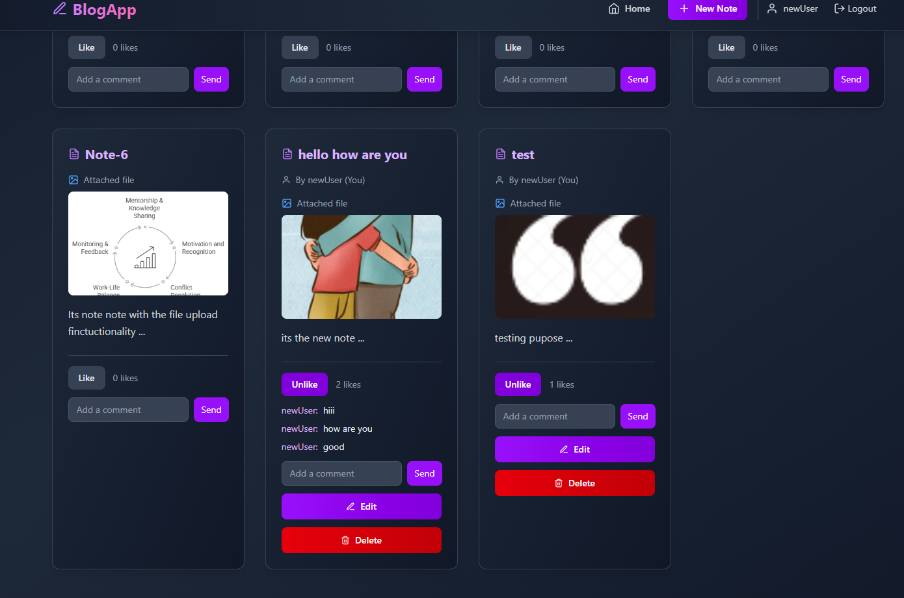

# BlogApp

A modern, full‑stack notes/blog application where users can create rich notes (with optional file attachments), see everyone’s notes, like and comment on any note, and directly message other authors.

## Highlights

- Authentication with JWT (register, login, logout)
- Notes CRUD with file upload (images/videos/any file via Cloudinary)
- View all notes; edit/delete restricted to the note’s creator
- Like/unlike any note; add comments with author metadata
- Direct messages between users (simple inbox and conversation threads)
- Polished React UI with protected routes

## Stack

- Frontend: React + Vite, Axios, React Router
- Backend: Node.js, Express, Mongoose
- Database: MongoDB
- Media: Cloudinary

## Quick Start

1. Prerequisites

- Node.js 18+
- MongoDB connection string
- Cloudinary account (for uploads)

2. Environment
   Create `backend/.env` with:

```
MONGO_URI=mongodb+srv://<user>:<pass>@<cluster>/<db>
JWT_SECRET_KEY=your_jwt_secret
CLOUDINARY_CLOUD_NAME=xxxx
CLOUDINARY_API_KEY=xxxx
CLOUDINARY_API_SECRET=xxxx
PORT=3000
```

3. Install & Run

- Backend

```
cd backend
npm i
npm start
```

Expected: "Server is ruuning on http://localhost:3000".

- Frontend

```
cd frontend
npm i
npm run dev
```

Open the printed Vite URL (default `http://localhost:5173`).

## Usage

- Register or login
- Create a note (optional file). All authenticated users can view all notes
- Only the creator will see Edit/Delete buttons on their notes
- Use Like/Unlike and add comments on any note
- Use "Message <author>" to open the chat with that user

## API Overview

- Auth: `POST /api/v1/auth/register`, `POST /api/v1/auth/login`, `POST /api/v1/auth/logout`
- Notes: `GET /api/v1/notes`, `GET /api/v1/notes/:id`, `POST /api/v1/notes` (multipart), `PUT /api/v1/notes/:id` (multipart, owner only), `DELETE /api/v1/notes/:id` (owner only)
- Interactions: `POST /api/v1/notes/:id/like` (toggle), `POST /api/v1/notes/:id/comments`
- Chat: `POST /api/v1/messages`, `GET /api/v1/messages`, `GET /api/v1/messages/with/:withUser`

## Permissions

- View: any authenticated user can view all notes
- Update/Delete: only the note’s creator
- Likes/Comments/Chat: any authenticated user

## Project Structure

```
backend/
  controllers/  # auth, notes, uploads, chat
  middleware/   # JWT auth
  models/       # User, Note, Message
  routes/       # /notes, /auth, /messages
  server.js
frontend/
  src/
    components/ # UI components
    pages/      # Create/Edit/Login/Register/Chat
    contexts/   # AuthContext
    api/        # axios instance
```

## Demo

Reference screenshots from the frontend public folder:




## Notes

- Ensure the frontend `axios` baseURL matches the backend port (`http://localhost:3000/api/v1`).
- After changing env vars, restart the backend.

—
Made with care for clarity, reliability, and a smooth developer experience.
